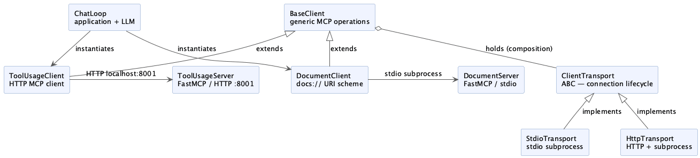

# MCP Client Architecture

## Overview

The MCP client stack is organized into three layers, each with a distinct responsibility. Generic MCP infrastructure sits at the base, domain-specific client adapters sit in the middle, and the application layer sits on top. No layer reaches through the one below it.

## Layers

### Generic infrastructure (`components/`)

**`ClientTransport`** is the abstract base for all transport implementations. It owns the async context manager protocol (`__aenter__` / `__aexit__`) once, so subclasses don't repeat it. Every concrete transport must implement `connect()`, `cleanup()`, and the `_session` property.

**`StdioTransport`** implements `ClientTransport` over stdio. It spawns the server as a child process, initializes the MCP session over stdin/stdout, and exposes the session as a protected property. The backing field (`__session`) is name-mangled to prevent access from outside the class.

**`HttpTransport`** implements `ClientTransport` over StreamableHTTP. It optionally spawns the server as a subprocess (via `uv run <server_script>`), waits for the HTTP endpoint to accept connections with a configurable retry budget, then initializes the MCP session over the HTTP streams. On cleanup, the MCP session is closed first and then the subprocess is terminated, avoiding broken-pipe errors.

**`BaseClient`** holds any `ClientTransport` via composition and provides all generic MCP operations: listing tools, resources, resource templates, and prompts; fetching a resource by URI (`_fetch_resource`); and calling a tool (`call_tool`). It declares `get_resource(uri)` as abstract, enforcing that every subclass defines how to interpret and return resource contents. `BaseClient` delegates its async context manager directly to the transport's `connect()` and `cleanup()`.

Nothing in `components/` knows about any specific server or URI scheme.

### Domain layer (`mcp_components/`)

**`DocumentClient`** constructs a `StdioTransport` internally (spawning `document_server.py` as a subprocess) and passes it to `BaseClient`. It implements `get_resource(uri)` for the `docs://` scheme: delegates the MCP fetch to `_fetch_resource`, then owns all response parsing — picking `contents[0]`, checking the mime type, and decoding JSON if needed.

**`DocumentServer`** is the FastMCP server that `DocumentClient` connects to over stdio. It exposes:
- `docs://documents` — a static resource listing all document names
- `docs://documents/{doc_id}` — a resource template for fetching a document by id
- `create_document` — a tool for adding new documents to the collection at runtime

**`ToolUsageClient`** constructs an `HttpTransport` (spawning `tool_usage_server.py` on port 8001) and passes it to `BaseClient`. It exposes no resources, so `get_resource` raises `NotImplementedError`. All interaction goes through `call_tool`.

**`ToolUsageServer`** is the FastMCP server that `ToolUsageClient` connects to over StreamableHTTP. It exposes four tools:
- `get_current_datetime` — returns the current date/time in a configurable format
- `add_duration_to_datetime` — adds a duration string (e.g. `2h`, `1d`) to a datetime
- `set_reminder` — stores a reminder message for a given time
- `get_reminders` — retrieves all stored reminders

### Application layer (`mcp_example.py`)

**`ChatLoop`** wires the Anthropic API to one or more MCP clients. It calls only public methods on `BaseClient` — `get_resource(uri)` and `call_tool(name, args)` — with no knowledge of session internals, transport type, or response shapes. It builds a cached system prompt from each client's capability metadata at session start, then exposes `read_resource` and `call_tool` as Anthropic tools so the LLM can decide what to fetch and when.

## Key design decisions

**Composition over inheritance for `BaseClient`.** The original design had `BaseClient` extend `StdioTransport` directly, which hardwired stdio as the only transport. Switching to composition (`BaseClient` holds a `ClientTransport`) makes the transport pluggable without any changes to `BaseClient` or its subclasses. Each domain client constructs the transport it needs and passes it up.

**`BaseClient` accesses `self._transport._session` directly.** This crosses one protected boundary by design. `BaseClient` lives in the same `components/` package and is the only non-transport code that needs the raw `ClientSession`. The single-underscore convention signals "internal to this package," which applies here.

**`get_resource` takes a URI, not a logical name.** The LLM always provides a full URI when it calls `read_resource`, so accepting a URI directly is the natural public contract. Subclasses that need to construct URIs from logical names can do so internally.

**`_fetch_resource` is protected, not public.** It returns raw MCP response contents with no interpretation. Only subclasses should call it; the application layer goes through `get_resource` instead.

**`call_tool` is concrete on `BaseClient`.** MCP's tool-calling protocol is fully generic — the server defines the tool, and the session handles serialization. There is no server-specific logic to encapsulate, so no subclass needs to override it.

**`HttpTransport` manages the server subprocess lifecycle.** Spawning the server inside the transport (rather than requiring it to be running externally) keeps the demo self-contained, mirroring how `StdioTransport` spawns its stdio subprocess. The subprocess is terminated after the MCP session closes to avoid broken-pipe errors on the server side.

**The session is fully encapsulated within each transport.** Both `StdioTransport.__session` and `HttpTransport.__session` are name-mangled, preventing access from outside their respective classes. Subclasses and `BaseClient` reach the session through the `_session` property.
